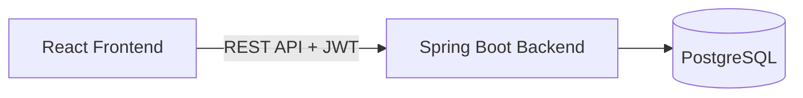
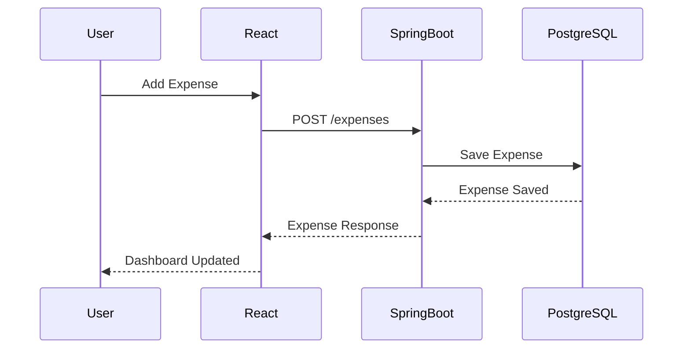
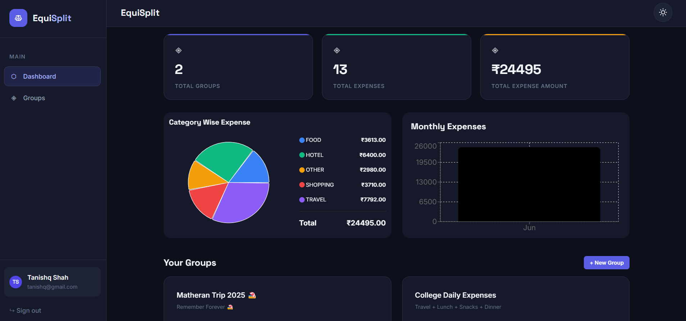
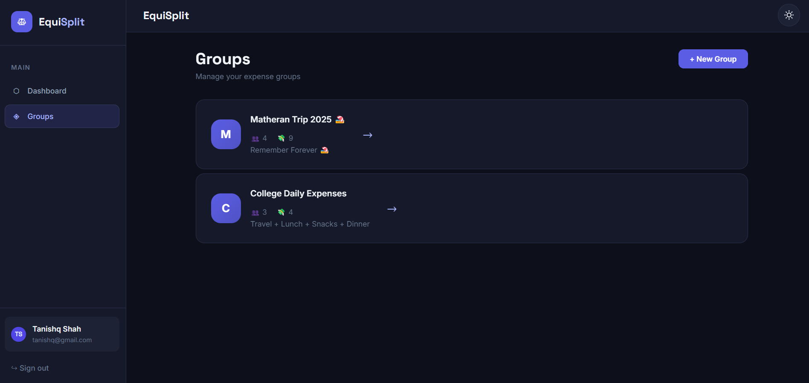
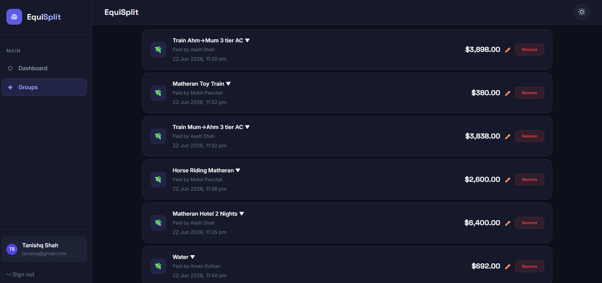
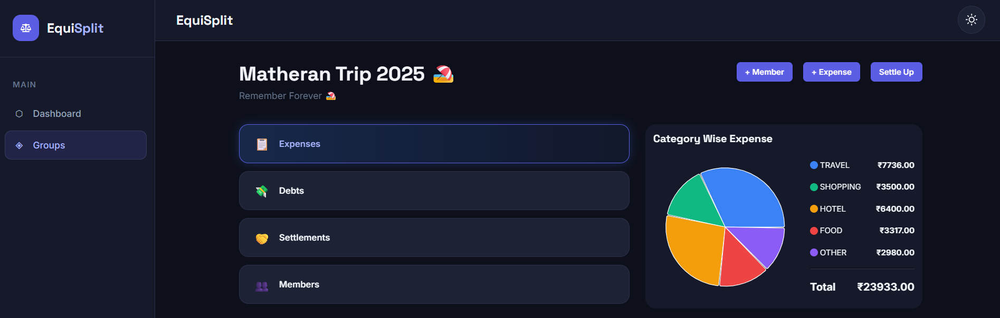
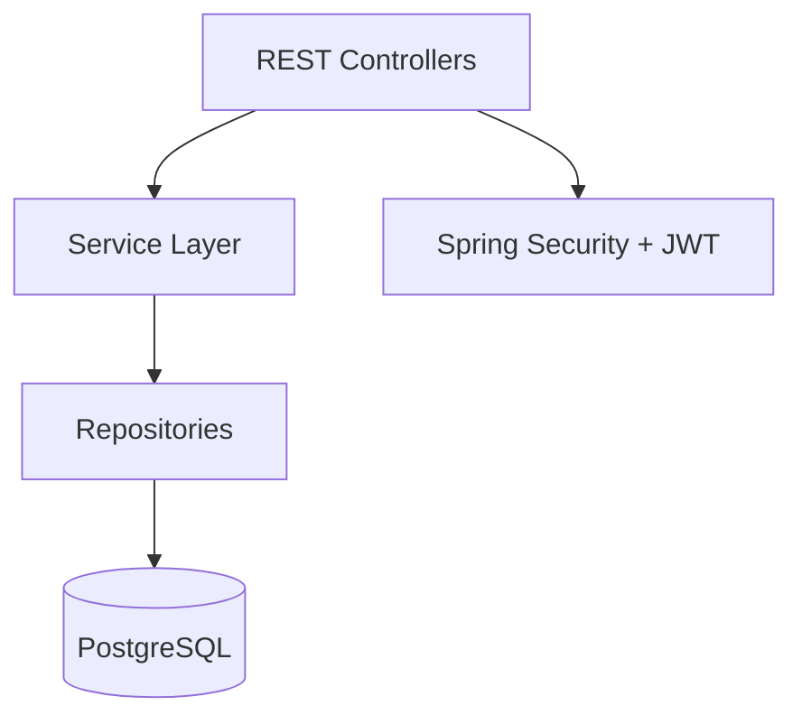
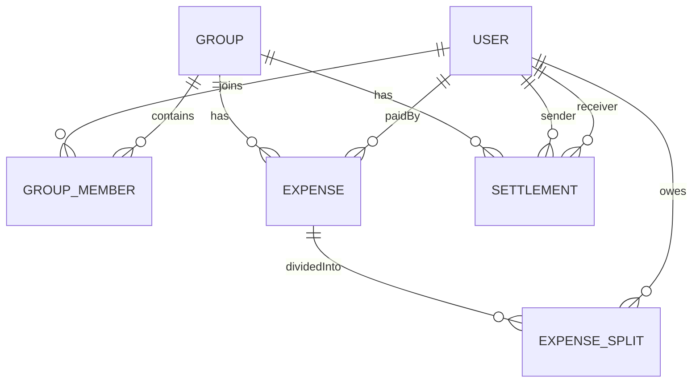
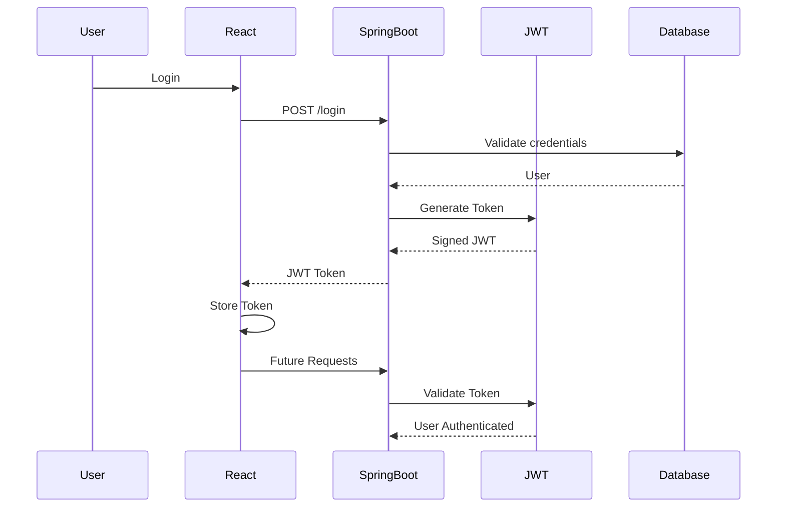
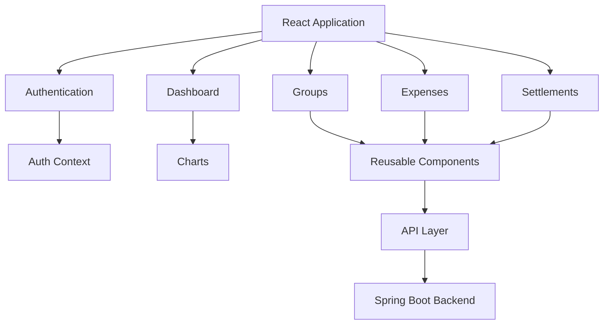

# ⚖️ EquiSplit

A production-inspired expense sharing platform built with Spring Boot and React that demonstrates secure authentication, financial data modeling, scalable REST APIs, and modern full-stack architecture.

<p align="center">


</p>

---

## 📌 Overview

EquiSplit simplifies expense management for trips, roommates, friends, and teams by providing a seamless way to create groups, record shared expenses, calculate balances, and track settlements.

Unlike basic expense trackers, EquiSplit supports multiple split strategies while providing interactive dashboards, analytics, secure authentication, and a responsive modern UI.

---

## 🚀 Live Demo

| Service | URL |
|----------|-----|
| 🌐 Frontend | [App](https://equisplit-app.vercel.app/) |
| ⚙ Backend API | [Backend](https://equisplit-dqw0.onrender.com/) |
| ❤️ Health Endpoint | [Health Point](https://equisplit-dqw0.onrender.com/api/health) |

---

# Architecture



---

# Request Flow



---

# Features

| Category | Features |
|-----------|----------|
| Authentication | JWT Login • Registration • Protected Routes |
| Groups | Create Groups • Edit Groups • Delete Groups |
| Members | Add Members • Remove Members |
| Expenses | Create • Edit • Delete Expenses |
| Split Types | Equal • Exact Amount • Percentage |
| Settlement | Record Settlements |
| Dashboard | Total Groups • Total Expenses • Expense Analytics |
| Analytics | Category Pie Chart • Monthly Expense Bar Chart |
| UI | Dark Theme • Light Theme • Responsive Design |
| Security | JWT Authentication • Route Protection • Input Validation |

---

# Screenshots

### Dashboard



---

### Groups



---

### Expense Details



---

### Analytics



---

# Core Functionalities

✅ User Authentication

✅ Group Management

✅ Expense Tracking

✅ Multiple Split Algorithms

✅ Balance Calculation

✅ Settlement Tracking

✅ Dashboard Analytics

✅ Dark / Light Theme

✅ Responsive UI

---

# Backend Architecture

EquiSplit follows a layered architecture that separates concerns between presentation, business logic, persistence, and security.



The backend is built using **Spring Boot** and follows RESTful design principles. Every request passes through JWT authentication before reaching the business layer. Services contain all business logic while repositories handle database interactions through Spring Data JPA.

---

# Database Design

The application models relationships between users, groups, expenses, settlements, and expense splits.



---

# Authentication Flow



JWT authentication removes the need for server-side sessions, allowing the backend to remain stateless and scalable.

---

# Expense Splitting Strategies

EquiSplit supports three independent split algorithms.

---

# Validation

The backend validates every request before persisting data.

Examples include

- Positive expense amount
- Valid split totals
- Percentage equals exactly 100%
- User belongs to the selected group
- Paid-by user exists
- JWT authentication
- Protected routes
- Input sanitization

Invalid requests return meaningful HTTP error responses.

---

# Security

The application implements multiple security layers.

- JWT Authentication
- BCrypt Password Hashing
- Stateless Sessions
- Route Protection
- Input Validation
- Global Exception Handling
- CORS Configuration
- Protected REST APIs

Passwords are never stored in plain text.

---

# Engineering Decisions

### Why Spring Boot?

Spring Boot provides

- Dependency Injection
- Auto Configuration
- Spring Security
- Spring Data JPA
- Production-ready REST APIs

allowing rapid development while following enterprise architecture.

---

### Why PostgreSQL?

PostgreSQL provides

- ACID transactions
- Foreign Key Constraints
- Reliable relational modeling
- Excellent indexing performance

which makes it suitable for financial-style applications.

---

### Why BigDecimal?

Money calculations require exact precision.

Using `double` may introduce rounding errors.

Instead, EquiSplit performs every monetary calculation using `BigDecimal` to guarantee accurate financial computations.

---

# API Design

The backend exposes RESTful APIs grouped by resource.

| Module | Responsibilities |
|---------|------------------|
| Authentication | Login, Register |
| Groups | CRUD Operations |
| Members | Add / Remove Members |
| Expenses | CRUD + Split Calculation |
| Settlements | Record Payments |
| Dashboard | Analytics & Reports |

# Frontend Architecture

The frontend is built using **React** and follows a component-driven architecture that emphasizes modularity, reusability, and maintainability.

Pages are composed of reusable UI components while API communication is abstracted into dedicated service modules.



---

# Client-side Routing

The application uses **React Router** with protected routes to ensure only authenticated users can access secured pages.

# State Management

Instead of introducing a heavyweight state management library, EquiSplit relies on React's built-in APIs.

## Context API

Global authentication state is managed using Context.

It stores

- Logged-in user
- JWT token
- Login status
- Logout functionality

This avoids unnecessary prop drilling across the application.

---

## Local Component State

Feature-specific state is managed using React Hooks.

Examples include

- Form inputs
- Dashboard analytics
- Group details
- Expense lists
- Loading indicators
- Error handling

Keeping state close to where it is used improves readability and simplifies maintenance.

---

# API Layer

All backend communication is centralized into dedicated API modules.

```
api/

├── apiClient.js
├── authApi.js
├── groupsApi.js
├── expensesApi.js
├── settlementsApi.js
└── dashboardApi.js
```

This abstraction provides

- Cleaner components
- Easier maintenance
- Consistent request handling
- Automatic JWT attachment
- Centralized error handling

---

# Reusable UI Components

The application is built around reusable components to ensure consistency across the interface.

```
components/

├── Button
├── Input
├── Select
├── Alert
├── Avatar
├── EmptyState
├── Spinner
├── ProtectedRoute
├── CategoryPieChart
└── MonthlyBarChart
```

Each component is designed to be reusable, theme-aware, and accessible.

---

## API Documentation

Interactive API documentation is available through Swagger UI.

```
http://localhost:8080/swagger-ui/index.html
```

---

# Project Structure

```
EquiSplit/

├── backend/
│
│   ├── config/
│   │     ├── SecurityConfig.java
│   │     ├── JwtAuthenticationFilter.java
│   │     └── OpenApiConfig.java
│   │
│   ├── controller/
│   │     ├── AuthController.java
│   │     ├── GroupController.java
│   │     ├── ExpenseController.java
│   │     ├── SettlementController.java
│   │     └── DashboardController.java
│   │
│   ├── service/
│   │     ├── AuthService.java
│   │     ├── GroupService.java
│   │     ├── ExpenseService.java
│   │     ├── SettlementService.java
│   │     └── DashboardService.java
│   │
│   ├── repository/
│   │
│   ├── entity/
│   │
│   ├── dto/
│   │
│   ├── security/
│   │
│   └── exception/
│
├── frontend/
│
│   ├── api/
│   ├── components/
│   ├── context/
│   ├── hooks/
│   ├── features/
│   │      ├── auth/
│   │      ├── dashboard/
│   │      ├── groups/
│   │      └── expenses/
│   │
│   ├── utils/
│   └── styles/
│
└── README.md
```

---

# Tech Stack

| Layer | Technology |
|--------|------------|
| Backend | Java 21 |
| Framework | Spring Boot 3 |
| Frontend | React 19 |
| Routing | React Router |
| Authentication | JWT |
| Database | PostgreSQL |
| ORM | Spring Data JPA / Hibernate |
| Charts | Recharts |
| Styling | CSS Modules |
| Build Tool | Maven |
| Deployment | Render |
| Database Hosting | Neon PostgreSQL |
| Version Control | Git & GitHub |

---

# Deployment

| Component | Platform |
|------------|----------|
| Frontend | Vercel |
| Backend | Render |
| Database | Neon PostgreSQL |

The application is deployed as separate frontend and backend services communicating through REST APIs.

---

# Running Locally

## Clone the Repository

```bash
git clone https://github.com/Tanishq7361/EquiSplit.git

cd EquiSplit
```

---

## Backend

```bash
cd backend

mvn clean install

mvn spring-boot:run
```

Runs on

```
http://localhost:8080
```

---

## Frontend

```bash
cd frontend

npm install

npm start
```

Runs on

```
http://localhost:3000
```

---

# Environment Variables

## Backend

```
SPRING_DATASOURCE_URL=

SPRING_DATASOURCE_USERNAME=

SPRING_DATASOURCE_PASSWORD=

JWT_SECRET=
```

---

## Frontend

```
REACT_APP_API_URL=http://localhost:8080/api/v1
```

---

# Build for Production

Backend

```bash
mvn clean package
```

Frontend

```bash
npm run build
```

---

# License

This project is licensed under the MIT License.

# Engineering Decisions

Building EquiSplit involved more than implementing CRUD APIs. Several architectural and implementation decisions were made to improve maintainability, scalability, and correctness.

---

## Stateless Authentication with JWT

Instead of maintaining server-side sessions, the application uses **JSON Web Tokens (JWT)**.

### Benefits

- Stateless backend
- Easy horizontal scaling
- Reduced server memory usage
- Suitable for REST APIs

Each protected request passes through a JWT authentication filter before reaching the controller layer.

---

## Layered Architecture

The backend follows a layered architecture.

```
Controller
      │
      ▼
Service Layer
      │
      ▼
Repository Layer
      │
      ▼
Database
```

This separation keeps business logic independent from HTTP and persistence concerns.

---

## Expense Splitting Strategy

Instead of storing only the total expense amount, every expense creates dedicated **ExpenseSplit** records.
```

This significantly simplifies

- balance calculation
- settlement generation
- reporting
- future analytics

---

## Reusable Component Design

The frontend emphasizes component reusability.

Examples

- Button
- Input
- Select
- Avatar
- Alert
- Charts
- Empty State

Reusable components reduce duplicated code and improve maintainability.

---

# Security Considerations

The application incorporates multiple security best practices.

✅ Password hashing using BCrypt

✅ JWT authentication

✅ Protected routes

✅ Input validation

✅ Global exception handling

✅ Authorization checks

Only authenticated users can access or modify their own groups and expenses.

---

# Scalability Considerations

Although EquiSplit is designed for educational purposes, the architecture allows future scaling.

Possible improvements include

- Redis caching
- Docker containerization
- Kubernetes deployment
- Microservice decomposition
- Asynchronous notifications
- Event-driven settlement processing

The layered architecture enables these improvements without major code restructuring.

---

# Challenges Faced

During development, several engineering challenges were encountered.

### Expense Split Validation

Ensuring

```
Exact Split

sum(split amounts)

=

Expense Amount
```

required backend validation before persistence.

---

### Percentage Validation

The application validates that

```
Σ Percentage = 100%
```

before accepting the request.

---

### Equal Split Editing

Editing an existing expense while allowing members to be added or removed required redesigning the split generation logic.

The backend now recreates expense splits after every update to maintain consistency.

---

### Numeric Input Handling

Browsers automatically modify number inputs using

- mouse wheel
- arrow keys

Custom input handling was implemented to prevent accidental value changes while still supporting decimal values and keyboard shortcuts.

---

# Lessons Learned

Building EquiSplit provided practical experience with

- REST API Design
- Spring Security
- JWT Authentication
- Hibernate Relationships
- React Hooks
- Context API
- Responsive UI Design
- Financial Data Modeling
- Component Reusability
- Production Deployment

---


# Project Metrics

| Metric                   | Value |
| ------------------------ | ----: |
| Java Classes             |   80+ |
| React Components         |   35+ |
| REST Endpoints           |   25+ |
| Database Tables          |     7 |
| Authentication           |   JWT |
| Expense Split Algorithms |     3 |
| Charts                   |     2 |
| Deployment Platforms     |     3 |

---

# Key Highlights

✔ Secure JWT Authentication

✔ Multiple Expense Splitting Algorithms

✔ Interactive Analytics Dashboard

✔ Responsive User Interface

✔ Dark / Light Theme

✔ Reusable Component Architecture

✔ Layered Backend Design

✔ PostgreSQL Relational Data Model

✔ Financial Precision using BigDecimal

✔ Modern React Architecture

---

# Contributing

Contributions are welcome.

1. Fork the repository

2. Create a feature branch

```bash
git checkout -b feature/new-feature
```

3. Commit your changes

```bash
git commit -m "feat: add new feature"
```

4. Push to your fork

```bash
git push origin feature/new-feature
```

5. Open a Pull Request

---

# Acknowledgements

This project was developed as a practical exploration of modern full-stack software engineering concepts including

- Spring Boot
- React
- PostgreSQL
- JWT Authentication
- Financial System Design
- Responsive UI Development

It reflects best practices learned through building real-world applications and continuous iteration.

---

# Connect With Me

**Tanishq Shah**

- GitHub: https://github.com/Tanishq7361
- LinkedIn: https://www.linkedin.com/in/tanishq-shah7/
- Email: tanishq7361@gmail.com

---

<div align="center">

### ⭐ If you found this project interesting, consider giving it a star.

It motivates me to continue building high-quality open-source software.

</div>
